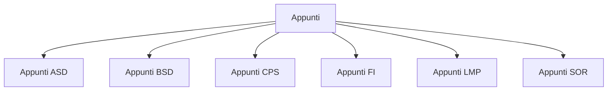

# Indice

- [[Lezione 1 - Capitolo 1]]
- [[Lezione 2 - Capitolo 2]] 
- [[Lezione 3 - Capitolo 2]]
- [[Lezione 4 - Capitolo 2]]
- [[Lezione 5 - Capitolo 4]]
- [[Lezione 6 - HeapSort]]
- [[Lezione 7 - Capitolo 4]]
- [[Lezione 8 - Capitolo 4]]
- [[Lezione 9 - Capitolo 5]]
- 

# Grafo delle lezioni

