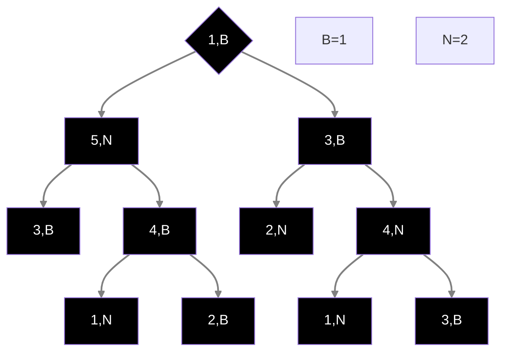

# Esercizio 1

## (a)

- $n+n^2log(n)^2=o(n^2log(n))?$ NO
- $2^{\sqrt{log(n)}}=o(\sqrt{n}^3)?$ Si
- $log(n)^4=o(\sqrt{n}^3)?$ Si
- $2^n=\Theta(2^n+1.5^n)?$ Si
- $n^2=\Omega(\frac{n^2}{log(n)^{2001}})?$ NO
- $2^{n+8}=\omega(2^n)?$ NO
- $\frac{n\sqrt{n+log(n)}}{\sqrt{n^3+3}}=\Theta(log(n))?$ NO
- $2^n=\Theta(2^n+2^{n/2})?$ Si

## (b)

1. $T(n)=T(n/3)+n,T(1)=1$
	1. $a=1,b=3,f(n)=n=\Omega(n^{log_31}+\varepsilon)\implies$ caso 3 TH Master $\implies T(n)=\Theta(n)$
2. $$\begin{align}&T(n)=2T(n-4)+1\implies 4T(n-8)+2+1\implies\\&8T(n-12)+4+2+1\implies ...\implies 2^iT(n-4i)+\sum_{j=0}^{i-1}2^j\end{align}$$ caso base per $i=\frac{n-1}{4}$, quindi $$T(n)=2^{\frac{n-1}{4}}T(1)+\sum_{j=0}^{\frac{n+3}{4}}2^j\implies T(n)=\Theta(2^n)$$

## (c)

1. Utilizzo il BucketSort e come chiave uso il voto dell'esame di algoritmi, costo $O(n+k)$
2. Uso l'algoritmo di visita in preordine, costo $O(n)$
3. Posso usare l'algoritmo di visita in ampiezza o in profondita, costo $O(n+m)$
4. Uso l'algoritmo di Dijkstra che usa una coda con priorità implementata con Heap di Fibonacci, costo $O(m+nlog(n))$

# Esercizio 2

## Idea

L'idea è quella di tenere le informazioni "dall'alto" quando si visita un nodo, per poi andare a calcolare il numero di antenati blu o gialli del nodo stesso, e verificare se il nodo rispecchia la condizione dell'esercizio

## Correttezza

Prendiamo un istanza di esempio, tipo :



Possiamo subito dire che la radice non farà parte dei nodi che rispecchiano la prorpietà richiesta, dato che la radice non ha antenati( e quindi il numero di antenati blu sarà $0$, così come il numero di antenati gialli)

L'algoritmo va a visitare ogni nodo dell'albero, e per ogni nodo che visita si porta alcune informazioni "dall'alto", ovvero la somma dei nodi neri e dei nodi bianchi, che poi verrano usati come "antenati" del nodo successivo.

Se il nodo che si sta visitando è una foglia, l'algoritmo va a controllare se la somma degli antenati blu è $\geq b$ o se la somma degli antenati neri è $\geq n$.
Se si, ritorno 1 (sto dicendo che il nodo in questione è uno dei nodi che rispecchiano la prorpietà), altrimenti ritorno 0

Se il nodo non è una foglia, l'algoritmo istanzia una variabile, "s", che è la variabile che mi dice se il nodo appartiene (s=1) o non appartiene (s=0) alla lista di nodi che devo ritornare
Poi l'algoritmo va a controllare se la somma degli antenati blu è $\geq b$ o se la somma degli antenati neri è $\geq n$; se si, imposto s=1, altrimenti s rimarrà uguale a 0

Poi controllo il colore del nodo che sto visitando:
1. se $col(v)=b$, incremento di 1 il valore di $sb$
2. se $col(v)=n$, incremento di 1 il valore di $sn$

Infine, applico la ricorsione dell'algoritmo DFS su i due sottoalberi del nodo $v$ in questione, sommando il valore di s

### Pseudocodice

```
DFS(nodo v,b,n,sn,sb)
S=[]
S.append(v)
if left(v)=Null and right(v)=Null then
	if sn>=n or sb>=b then return 1
	else return 0
s=0
if sn>=n or sb>=b then s=1
if col(v) = B then sb++
else sn++
return s+DFS(left(v),b,n,sn,sb)+DFS(right(v),b,n,sn,sb)
```

## Analisi temporale

L'algoritmo ha costo $O(n)$, ovvero il costo della visita in DFS classica

# Esercizio 3

