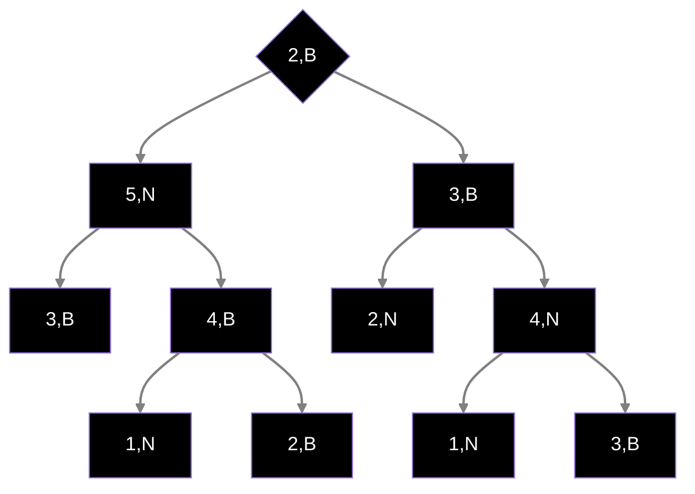

# Esercizio 2

Mostriamo un istanza dell'albero binario per il problema in questione



Già osservardo l'istanza in questione, possiamo intuire che la radice sarà sicuramente uno dei nodi che rispettano la condizione posta dal problema (dato che la radice non ha antenati, quindi la somma delgi antenati bianchi sarò uguale a quella dei neri, ovvero 0), mentre per verificare se altri nodi rispettano la condizione richiesta è sufficiente utilizzare una visita in profondità (DFS) andando a verificare, di volta in volta, a controllare le somme parziali
In primo luogo definiamo una procedura che estrae la radice dell'albero, che poi richiama la visita in DFS partendo dalla radice

Di seguito lo pseudo codice 

Antenati(T)
r = radice(T)
return Alg(r, 0, 0)

Alg(v, sn, sb)
	if (s(v) == NULL AND d(v) == NULL) then // (se il nodo v è una foglia)
		if (sn == sb) then 
			return 1
		else 
			return 0
	s = 0 // inizializzo un contatore di nodi che rispettano la proprietà; in
	// questo caso stiamo visitando un nodo generico
	if (sn == sb) then s = 1
	if (col(v) = b) then 
		sb = sb+val(v)
	else 
		sn = sn+val(v)
	return s+Alg(s(v), sn, sb)+Alg(d(v), sn, sb)

## Correttezza

La visita in profondità va a vedere, in primo luogo, se il nodo che si sta visitando è una foglia, e nel caso in cui sia effettivamente una foglia va a vedere se le somme parziali (sn,sb rispettivamente somma_neri,somma_bianchi) sono uguali; in caso in cui siano uguali, ritorna 1 altrimeno ritorna 0

Se il nodo che si sta visitando non è una foglia, si inizializza una variabile s, che sarà la somma totale, uguale a 0. Poi si verifica nuovamente se sn = sb e nel caso in cui siano uguali, imposta s = 1

A questo punto si va a controllare se il colore del nodo che si sta visitando è uguale a "b".
Nel caso in cui sia uguale a "b", allora si incrementa il contatore delle somme parziali bianche,sb, aggiungendo il valore del nodo effettivo, altrimenti se il colore del nodo è uguale a "n", si incrementa nello stesso modo il valore delle somme parziali neri, sn.

A questo punto si esegue una ricorsione sul figlio sinistro e destro del nodo corrente, sommando i valori ritornati dalle ricorsioni più il valore di s

Di seguito il codice scritto in python

```python
class TreeNode:
    def __init__(self, val,col, left=None, right=None):
        self.val = val
        self.left = left
        self.right = right
        self.col = col

def DFS(root,sn,sb):
    S = []
    S.append(root)
    if root.left == None and root.right == None:
        if sn == sb:
            return 1
        else:
            return 0
    s = 0
    if sn == sb:
        s = 1
    if root.col == "b":
        sb = sb+root.val
    else:
        sn = sn+root.val
    return s+DFS(root.left,sn,sb)+DFS(root.right,sn,sb)

def antenati(root):
    S = []
    S.append(root)
    radice = S[0]
    print(radice.val)
    return DFS(radice,0,0)

root = TreeNode(1,"b")
l1 = TreeNode(5,"n")
r1 = TreeNode(3,"b")
l1_l1 = TreeNode(3,"b")
l1_r1 = TreeNode(4,"b")

l1_r1_l1 = TreeNode(1,"n")
l1_r1_r1 = TreeNode(2,"b")
r1_l1 = TreeNode(2,"n")
r1_r1 = TreeNode(4,"n")
r1_r1_l1 = TreeNode(1,"n")
r1_r1_r1 = TreeNode(3,"b")

root.left = l1
root.right = r1
l1.left = l1_l1
l1.right = l1_r1
l1_r1.left = l1_r1_l1
l1_r1.right = l1_r1_r1
r1.left = r1_l1
r1.right = r1_r1
r1_r1.left = r1_r1_l1
r1_r1.right = r1_r1_r1
  
print(antenati(root))
```

## Analisi del costo

Il costo dell'algoritmo è $O(n)$, dato che è una semplice visita in profondità e il calcolo della somma degli antenati neri e bianchi viene effettuata in tempo costante


