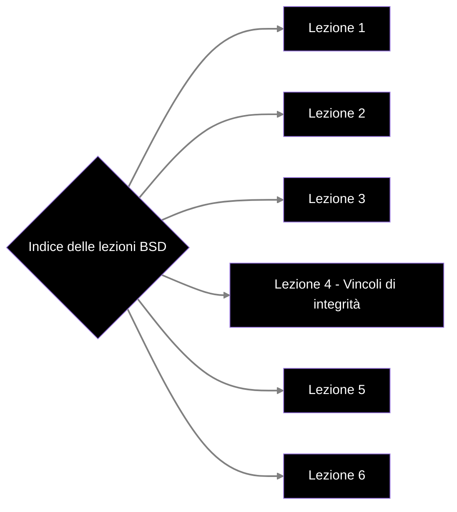

# Indice
- [[Appunti BSD/MOD I/Lezione 1|Lezione 1]]
- [[Appunti BSD/MOD I/Lezione 2|Lezione 2]]
- [[Lezione 3 - Modello Relazionale|Lezione 3]]
- [[Lezione 4 - Vincoli d'integrità]]
- [[Lezione 5 - Modello Concettuale, Modello ER]]
- [[Lezione 6 - Progettazione logica]]
- 

# Grafo delle lezioni

