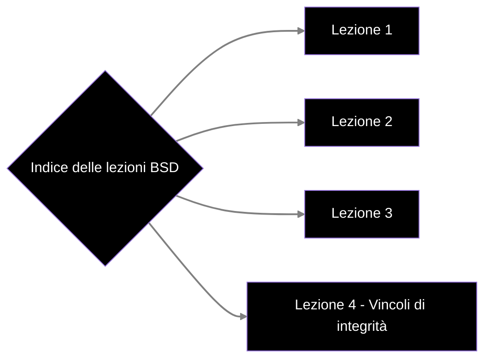

# Indice
- [[Appunti BSD/MOD I/Lezione 1|Lezione 1]]
- [[Appunti BSD/MOD I/Lezione 2|Lezione 2]]
- [[Appunti BSD/MOD I/Lezione 3|Lezione 3]]
- [[Lezione 4 - Vincoli d'integrità]]

# Grafo delle lezioni

