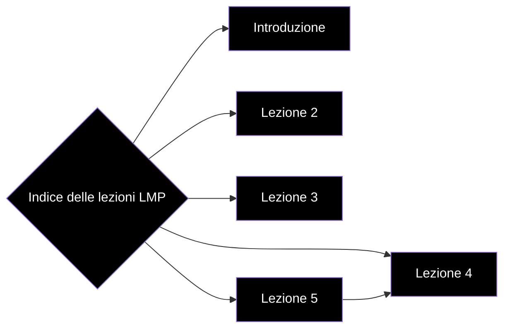

# Indice delle lezioni

- [[Appunti CPS/Lezione 1|Introduzione]]
- [[Appunti CPS/Lezione 2|Lezione 2]]
- [[Appunti CPS/Lezione 3|Lezione 3]]
- [[Appunti CPS/Lezione 4|Lezione 4]]
- [[Appunti CPS/Lezione 5|Lezione 5]]
- 

# Grafo delle lezioni

