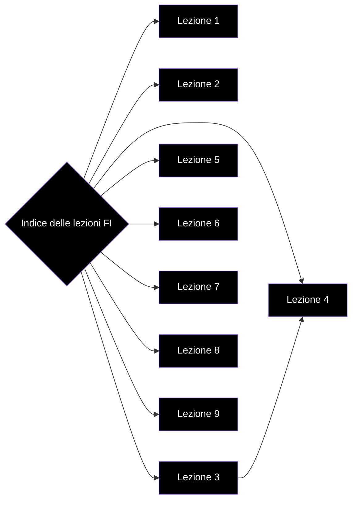

# Indice

- [[Lezione 1 - Insiemi infiniti, Linguaggi]]
- [[Lezione 2 - RE,Linguaggi e problemi]]
- [[Lezione 3 - RE,Grammatiche]]
- [[Lezione 4 - Ancora sulle grammatiche]]
- [[Lezione 5 - Automi]]
- [[Lezione 6 - ASF]]
- [[Lezione 7 - Equivalenza tra ASFD e ASFND]]
- [[Lezione 8 - RE,RG e ASF]]
- [[Lezione 9 - Sempre su RE,RG e ASF]]

# Grafo delle lezioni

