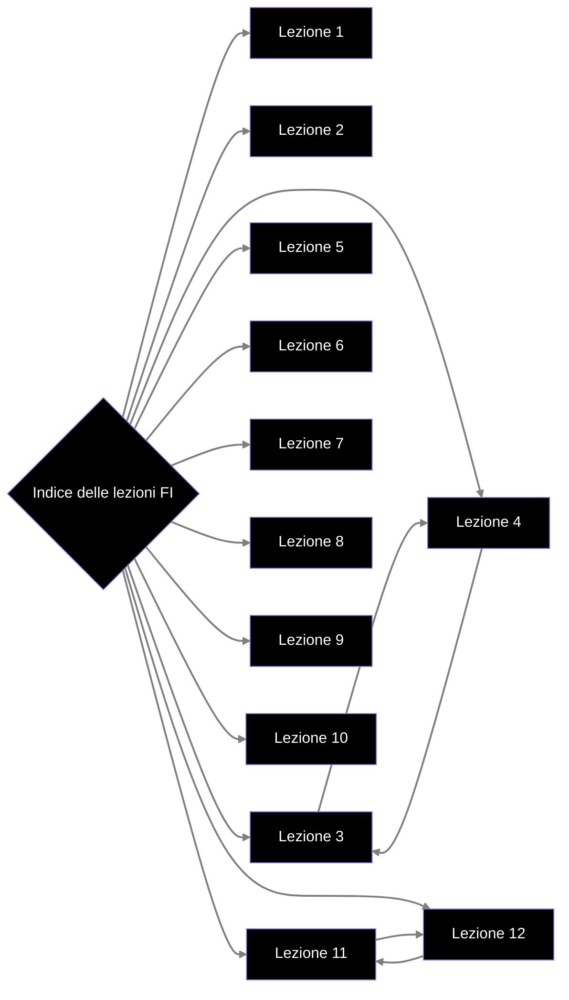

# Indice

- [[Lezione 1 - Insiemi infiniti, Linguaggi]]
- [[Lezione 2 - RE,Linguaggi e problemi]]
- [[Lezione 3 - RE,Grammatiche]]
- [[Lezione 4 - Ancora sulle grammatiche]]
- [[Lezione 5 - Automi]]
- [[Lezione 6 - ASF]]
- [[Lezione 7 - Equivalenza tra ASFD e ASFND]]
- [[Lezione 8 - RE,RG e ASF]]
- [[Lezione 9 - Sempre su RE,RG e ASF]]
- [[Lezione 10 - Minimizzazione di ASF]]
- [[Lezione 11 - Pumping Lemma,Linguaggi CF]]
- [[Lezione 12 - Sempre su Linguaggi CF]]
- [[Lezione 13 - CNF,GNF]]
- [[Lezione 14 - Pumping Lemma per CF]]
- [[Lezione 15 - Grammatiche Ambigue,Automi a Pila]]
- 

# Grafo delle lezioni

