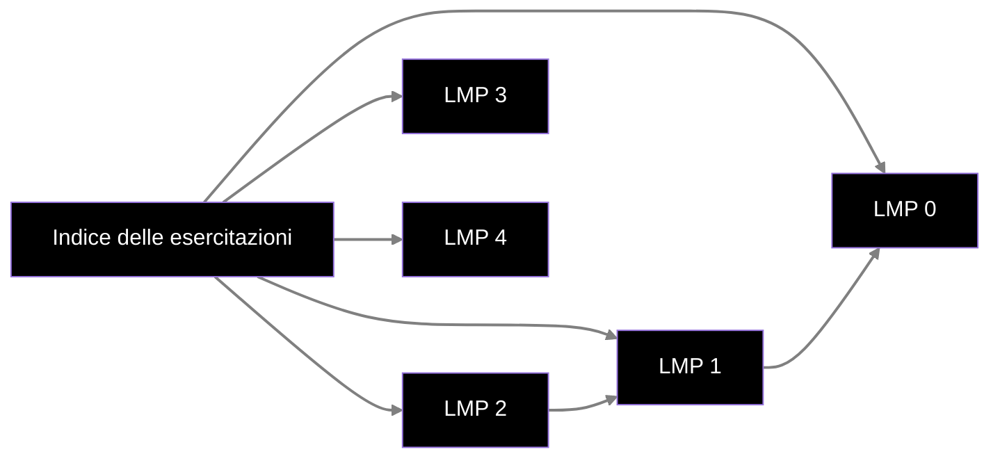

- [[LMP 0]]
- [[LMP 1]]
- [[LMP 2]]
- [[LMP 3]]
- [[LMP 4]]
- 

# Grafo delle esercitazioni

```mermaid
graph LR;
	A[Indice delle esercitazioni]
	B[LMP 0]
	C[LMP 1]
	D[LMP 2]
	E[LMP 3]
	F[LMP 4]

	linkStyle default stroke-width:2px,fill:none,stroke:grey,color:red
	
	style A fill:black, color:#fff
	style B fill:black, color:#fff
	style C fill:black, color:#fff
	style D fill:black, color:#fff
	style E fill:black, color:#fff
	style F fill:black, color:#fff
	A-->B & C & D & E & F
	C-->B
	D-->C
```

