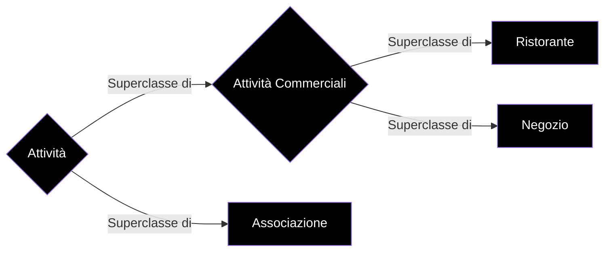

Svolto esercizio 1 Card Reader (vedi [Card Reader](http://art.uniroma2.it/teaching/lmp/part_I/stuff/Esempio%20di%20Compito%20-%20Card%20Reader.pdf))

- CardReader e CardFormatDeserializer sono le factory dell'esercizio
- BadlyFileFormattedException è l'eccezione custom

**Stuttura del progetto**

- Attività è la superclasse di Attività Commerciali e Associazione, nel emntre Attività Commerciali è la superclasse di Ristorante e Negozio

