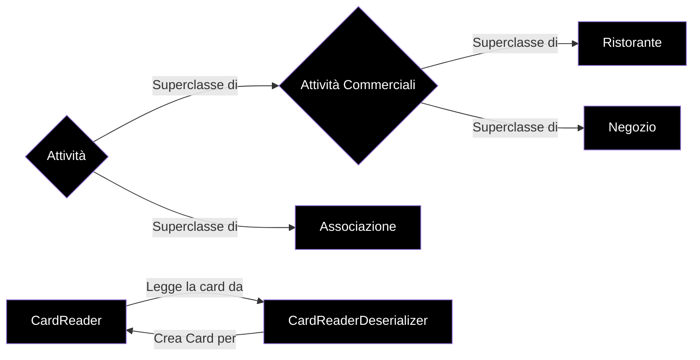

Svolto esercizio 1 Card Reader (vedi [Card Reader](http://art.uniroma2.it/teaching/lmp/part_I/stuff/Esempio%20di%20Compito%20-%20Card%20Reader.pdf))

- CardReader e CardFormatDeserializer sono le factory dell'esercizio
- BadlyFileFormattedException è l'eccezione custom

# Stuttura del progetto




- Attività è la superclasse di Attività Commerciali e Associazione, nel emntre Attività Commerciali è la superclasse di Ristorante e Negozio

# Codice 

Codice di Runner

```java
package it.uniroma2.art.lmp.ex;

import it.uniroma2.art.lmp.ex.model.*;

public class Runner {

	public static void main(String[] args) throws BadlyFileFormattedException {
		CardReader cr = new CardReader();
		Attività at_r = cr.acquisisciAttività("FileRistorante.txt");
		System.out.println("Attività:\n"+at_r);
		Attività at_n = cr.acquisisciAttività("FileNegozio.txt");
		System.out.println("Attività:\n"+at_n);
		Attività at_a = cr.acquisisciAttività("FileAssociazione.txt");
		System.out.println("Attività:\n"+at_a);	
	}
}
```

La factory crea in automatico, invocando il metodo acquisisciAttività, la card dell'attività Ristorante,Negozio e Associazione

Codice CardReader

```java
package it.uniroma2.art.lmp.ex.model;

import java.io.*;

public class CardReader {
	
	CardFormatDeserializer cfd = new CardFormatDeserializer();
	
	public Attività acquisisciAttività(String file) throws BadlyFileFormattedException {
		cfd.acquisisciCard(new File(file));
		switch(cfd.getCardType()) {
		case("ristorante"):
			return new Ristorante(cfd.getValue("sede"), 
					Integer.parseInt(cfd.getValue("in_attività_dal")), 
					cfd.getValue("partita_Iva"), 
					cfd.getValue("categoria"));
		case("negozio"):
			return new Negozio(cfd.getValue("sede"),
					Integer.parseInt(cfd.getValue("in_attività_dal")), 
					cfd.getValue("partita_Iva"),
					cfd.getValue("merce_Venduta"));
		case("associazione"):
			return new Associazione(cfd.getValue("sede"),
					Integer.parseInt(cfd.getValue("in_attività_dal")), 
					cfd.getValue("scopo"));
		default:
			throw new IllegalArgumentException("Card not valid");
		}		
	}
}
```

Metodo che crea l'oggetto Ristorante,Negozio o Associazione, e lancia l'eccezione custom "BadlyFileFormatted" in caso di errore di acquisisciCard

Codice CardFormatDeserializerInterface

```java
package it.uniroma2.art.lmp.ex.model;

import java.io.File;
import java.util.Set;

public interface CardFormatDeserializerInterface {
	public void acquisisciCard(File file) throws BadlyFileFormattedException;
	public String getCardType();
	public Set<String> getAllType();
	public String getValue(String attribute);
}
```

Interfaccia di CardFormatDeserializerInterface, per CardFormatDeserializer

Codice CardFormatDeserializer

```java
package it.uniroma2.art.lmp.ex.model;

import java.io.*;
import java.util.*;

public class CardFormatDeserializer implements CardFormatDeserializerInterface{
	Map<String,String> info;
	
	@Override
	public void acquisisciCard(File file) throws BadlyFileFormattedException{
		info = new HashMap<String,String>();
		try (BufferedReader bf = new BufferedReader(new FileReader(file))){ //try with resources
			String line;
			
			while((line = bf.readLine()) !=null) {
				String[] splitLine = line.split(":");
				//da mettere eccezione se splitLine.size > 2
				if (splitLine.length > 2) {
					throw new BadlyFileFormattedException();// lancia una eccezione custom se dopo il : ci sono più di una stringa
				}
				info.put(splitLine[0], splitLine[1]);
			}
			
		} catch (IOException e) {
			// TODO Auto-generated catch block
			e.printStackTrace();
			e.getMessage();
		}
	}
	@Override
	public String getCardType() {
		return info.get("filetype");//ritorno il tipo della card tramite il valore filetype della Map
	}
	@Override
	public Set<String> getAllType() {
		return info.keySet();//mi ritorna un set di tutte le chiavi della Map
	}
	@Override
	public String getValue(String attribute) {
		return info.get(attribute);
	}
}
```

- getCardType() ritorna il tipo della card tramite il valore filetype della Map, ovvero ritorna la card ristorante, negozio o associazione
- getAllType() ritorna il set di tutte le chiavi della map
- getValue() dato l'attributo, ritorna il valore associato
- acquisisciCard(File file), leggendo il file che gli viene passato in input (ovvero il file che gli viene dato in input nel runner dalla riga `Attività at_r = cr.acquisisciAttività("FileRistorante.txt");`), estrapola i dati dal file e crea la card dell'attività corrispondente

Codice BadlyFileFormattedException

```java
package it.uniroma2.art.lmp.ex.model;

public class BadlyFileFormattedException extends Exception {

	public BadlyFileFormattedException() {
		super("Il file non è formattato come si richede");
	}
}
```

Questa eccezione custom viene generata quando il file non è formattato secondo la formattazione richiesta dall'esercizio, ovvero `<attributo>:<valore>`

