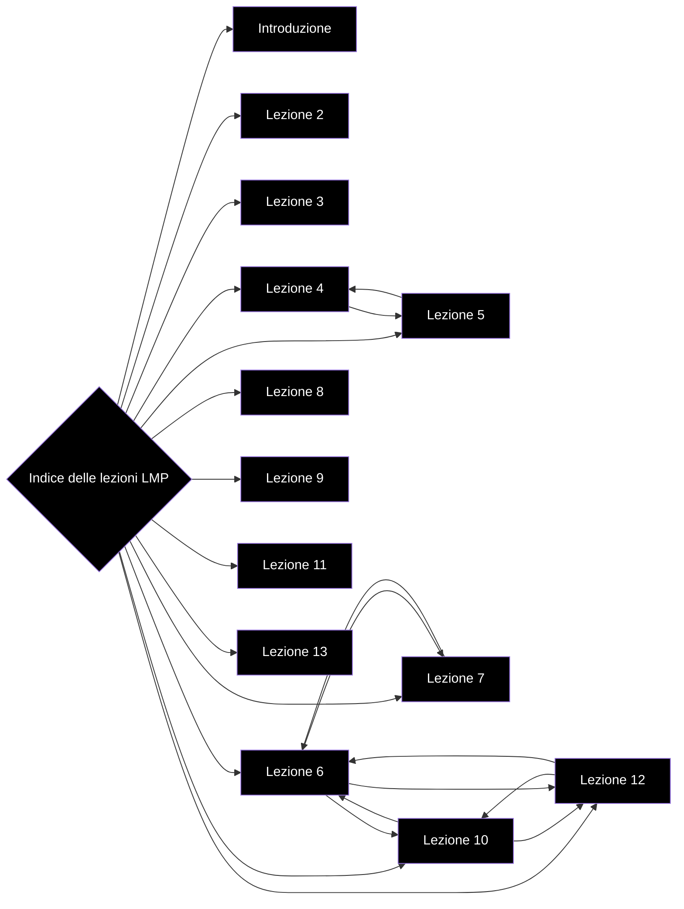

# Indice delle lezioni

- [[Introduzione]]
- [[Lezione 2 - Il linguaggio Java]]
- [[Lezione 3 - Concetti dell'OOP]]
- [[Lezione 4 - Basi del linguaggio]]
- [[Lezione 5 - Espressioni,Blocchi e Statement]]
- [[Lezione 6 - Classi]]
- [[Lezione 7 - Classi Nidificate]]
- [[Lezione 8 - Classi Anonime, Enum]]
- [[Lezione 9 - Metaprogrammazione]]
- [[Lezione 10 - Interfacce Parte 1]]
- [[Lezione 11 - Eccezioni]]
- [[Lezione 12 - Interfacce parte 2, Generics]]
- [[Lezione 13 - Collections]]
- [[Lezione 14 - Input-Output]]
- 

# Grafo delle lezioni

