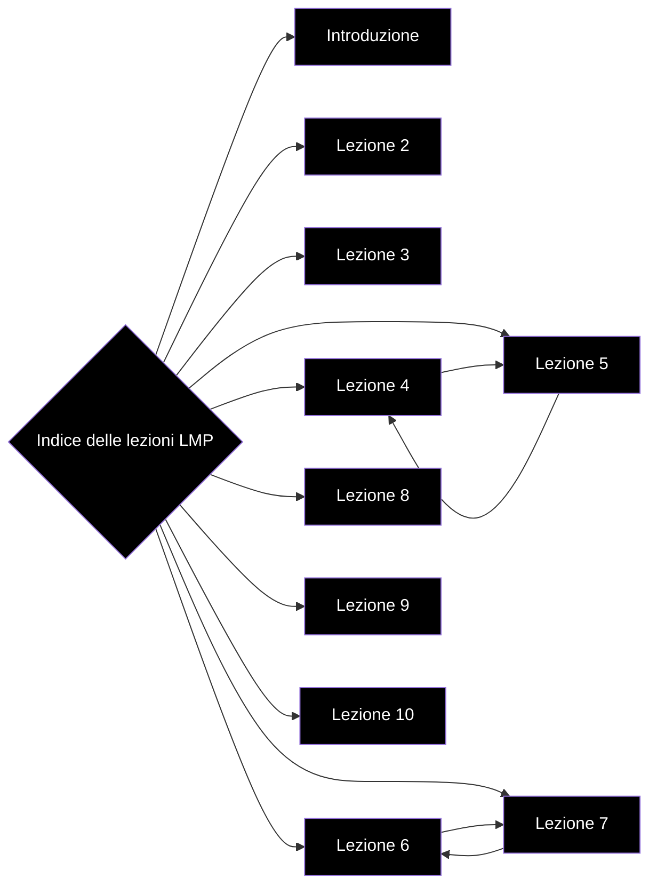

# Indice delle lezioni

- [[Introduzione]]
- [[Appunti LMP/MOD I/Lezione 2|Lezione 2]]
- [[Appunti LMP/MOD I/Lezione 3|Lezione 3]]
- [[Appunti LMP/MOD I/Lezione 4|Lezione 4]]
- [[Appunti LMP/MOD I/Lezione 5|Lezione 5]]
- [[Lezione 6]]
- [[Lezione 7]]
- [[Lezione 8]]
- [[Lezione 9 - Metaprogrammazione]]
- [[Lezione 10]]
- 

# Grafo delle lezioni

