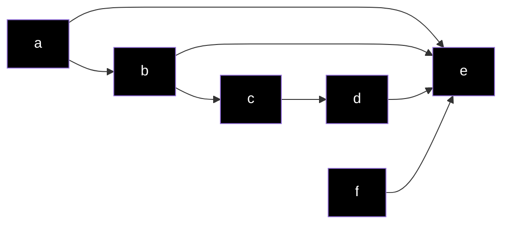

# I basilari del Prolog

Esercizio Cruciverba

```prolog
word(d,o,g).
word(r,u,n).
word(t,o,p).
word(f,o,u,r).
word(l,o,s,t).
word(f,i,v,e).
word(u,n,i,t).
word(m,e,s,s).
word(b,a,k,e,r).
word(f,o,r,u,m).
word(s,u,p,e,r).
word(g,r,e,e,n).
word(p,r,o,l,o,g).
word(v,a,n,i,s,h).
word(y,e,l,l,o,w).
word(w,o,n,d,e,r).
schema(A1,A2,A3,A4,A5,
       B1,B3,B5,
       C1,C2,C3,C4,C5,C6,
       D1,D5):-
    word(A1,A2,A3,A4,A5),
    word(C1,C2,C3,C4,C5,C6),
    word(A1,B1,C1,D1),
    word(A3,B3,C3),
    word(A5,B5,C5,D5).
```

## Elementi del Prolog

- Termini
- Predicati
- Clausole (Fatti e Regole)
- Programma Logico

### Termini

- **Atomi** : nomi che iniziano con lettera MINUSCOLA, sequenze di caratteri tra ' ', numeri preceduti da caratteri:
	- andrea
	- 'Corso di Prolog'
	- c1p8
- **Numeri** : 
	- 12345
- **Variabili** : nomi che iniziano con lettera MAIUSCOLA o con $\_$
	- Tizio
	- $\_$maschio
	- $\_$

### Predicati

Espressi tramite la notazione $f(t_1,...,t_n)$

f è un atomo che prende il nome di **funtore**

$t_1,...,t_n$ sono gli argomenti e sono dei termini (predicato f con n argomenti, ha arità n)

### Clausole

Le clausole: _fatti_ e _regole_

I fatti sono regole senza corpo

**Esempi**

- Fatti:
	- parent(ben,jim).
	- friend(luke, daisy).
- Regole:
	- grandparent(X,Y):-
		- parent(X,Z),
		- parent(Z,Y).

#### Regole

Head :- Body. significa che affinchè la Head sia vera deve essere vero il Body (e quindi i predicati che lo compongono)

Nel Body ci sono 1 o più predicati separati da "," (AND) o da ";" (OR)

Ogni regola termina con .

#### Fatti

Un fatto è un predicato seguito da .

Un fatto può essere composto da più termini

- 
```prolog
amico(fratello(alice,X),bob)
```


### Programma logico

Insieme di regole/fatti

Risponde alle query con true o false e assegna dei valori alle variabili

**Esempio: Famiglia**

```prolog
parent(anne, bill).
parent(anne, charlie).
parent(bill, donnie).
grandparent(X,Y):-
  parent(X,Z),
  parent(Z,Y).
```

 Query: 
```prolog
?- parent(anne,bill).
```
Risposta: true

Query
```prolog
?- parent(anne,X).
```
Risposta:
```prolog
X=bill
(premo ; )
X=charlie
(premo ; )
false
```

Query
```prolog
?- parent(X,Y).
```
Risposta
```prolog
X=anne, Y=bill
(premo ;)
X=anne, Y=charlie
(premo ;)
X=bill, Y=donnie
(premo ;)
false
```

## Esecuzione del programma

Prolog cerca nel proprio database di regole e fatti, quelli che soddisfano la nostra query, istanziando le variabili

Ogni variabile, una volta istanziata (unificata), non può assumere un secondo valore (a differenza dei linguaggi classici di programmazione, com Java,C,C++,etc...)

Per altri esempi vedi il file "Basi del linguaggio Prolog" pagina 13

**Esercizio**

Scrivere un programma Prolog che rappresenta un grafo tramite il fatto edge(A,B) per indicare che A e B sono connessi


Interrogare il programma realizzato per avere tutti i nodi raggiungibili partendo da b:
```prolog
?- path(b,X).
```

Soluzione
```prolog
edge(a,b).
edge(b,c).
edge(c,d).
edge(d,e).
edge(a,e).
edge(f,e).
edge(b,e).

path(X,Y):-
    edge(X,Y).
```

